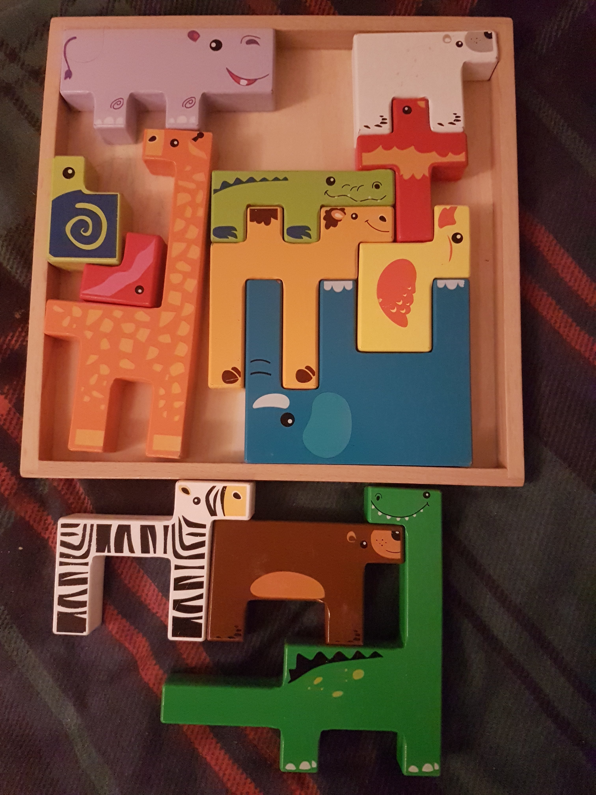

# Toddler Puzzle

## Background

Someone gave this puzzle to my 1-year-old niece. The box with an image of the solution got lost, the pieces scrambled, and no one could put it back together. My brother and I got nerd sniped about the problem. We discussed many approaches to solve it. I wrote most of it during a train ride across the UK.

## The puzzle

It has 13 pieces, as seen in the image above. They can be represented as squares glued together, and should fit the equivalent of a 12 by 12 board. No spot should be left empty.

## The solution

I started with a simple brute force approach. I let that run for 12+ hours, and it failed to find an answer. Then, I made a single optimisation and got a solution in 10 minutes.
